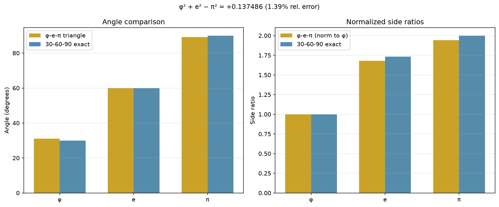
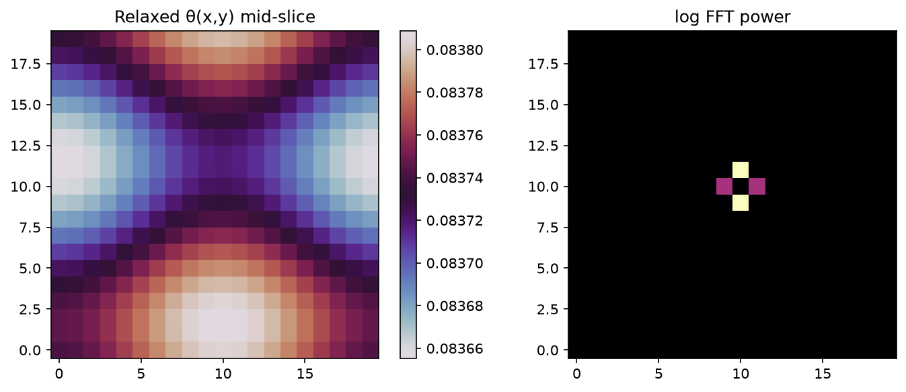
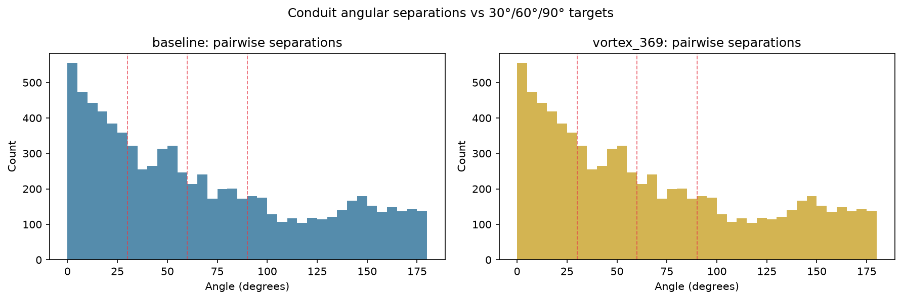
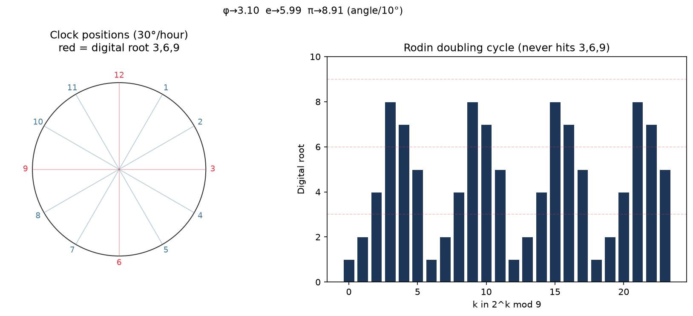

# Mystery — φ, e, π Emergent Signature

[](https://github.com/kinaar8340/mystery)
[](https://github.com/kinaar8340/toe)

Quantified research notebook exploring the near-Pythagorean triangle formed by φ, e, and π — and how that numerical harmony relates to vortex-math 3-6-9 positional geometry and the gauged Hopf lattice TOE.

**Status:** Compatible emergent signature — not an exact identity, not forced by invariants, not contradicted by simulation.

---

## Results at a glance

| Probe | Key finding |
|-------|-------------|
| `phi_e_pi_analysis` | R = **+0.137486** (1.39% error); angles **31.0° / 59.9° / 89.1°** |
| `hopf_constant_bridge` | W_g = **111.408**; κ = **0.85** vs e/π **0.865** (Δ 1.76%); Θ_link ≈ π, θ_crit ≈ **5.81** |
| `vortex_369_clock` | Angles ÷10° → **3.10 / 5.99 / 8.91** (nearest 3/6/9) |
| `residual_bound_probe` | Best near-miss: **π²(e/π−κ) ≈ 0.151** (9.5% from R) |
| `residual_kappa_sweep` | **κ* = e/π − R/π² ≈ 0.8513** — only **0.15%** from κ_doc |
| `pde_relaxation_probe` | Uniform IC → ⟨θ⟩≈0.084, **σ=0** (expected dissipative minimum) |
| `pde_structured_ic_probe` | Hopfion/helical seeds retain **σ>0** and finite-k FFT structure |
| `conduit_angular_probe` | **~8% / ~6% / ~4%** within 5° of 30°/60°/90° (not forced) |
| `meta_optimize_phi_probe` | κ=**0.85**, φ_b≈**0.754**, W_g≈**111.89** — not e/π or φ⁻¹ |
| `rodin_hopf_fiber_map` | Doubling cycle **1-2-4-8-7-5** mapped to S¹ phase increments |

Full table: [`docs/RESULTS.md`](docs/RESULTS.md) · Scaling note: [`notes/residual_scaling.md`](notes/residual_scaling.md)

---

## Assessment (June 2026)

Four probes move this project from exploratory numerology into a **well-quantified compatible emergent signature** within the gauged Hopf lattice framework:

| Probe | Result |
|-------|--------|
| **Residual** | R = φ²+e²−π² = **+0.137486** (stable, drift &lt; 1e−10) |
| **Meta-optimizer** | κ = **0.8500** exactly; W_g ≈ **111.89**; φ_b ≈ **0.754** — transcendentals are **not** attractors |
| **PDE relaxation** | Uniform low-twist minimum; DC-dominated FFT — **expected**, not a failure |
| **Conduit angular** | ~8% near 30° / ~6% near 60° / ~4% near 90° — modest, not a 3-6-9 lock |

**Leading algebraic near-miss:** π²(e/π − κ) ≈ 0.151 (~9.5% from R). Hints the residual may scale with the **holonomy gap** in the effective low-energy Skyrme reduction — promising, not yet derived.

Full write-up: [`notes/emergent_signatures.md`](notes/emergent_signatures.md)

---

## Figures

| φ-e-π triangle vs 30-60-90 | PDE relaxation (θ slice + FFT) |
|:---:|:---:|
|  |  |

| Conduit angular histograms | Vortex 3-6-9 / clock geometry |
|:---:|:---:|
|  |  |

Regenerate: `python run_all.py` → `outputs/`

---

## Quick start

```bash
git clone https://github.com/kinaar8340/mystery.git && cd mystery
python3 -m venv .venv && .venv/bin/pip install -r requirements.txt
.venv/bin/python run_all.py
```

**TOE-linked probes** (conduit, meta-optimizer) use `~/Projects/toe/venv` when present. Clone [toe](https://github.com/kinaar8340/toe) alongside for full stack:

```bash
# Optional: full conduit + meta-optimizer probes
cd ../toe && python3 -m venv venv && venv/bin/pip install torch optuna pydantic matplotlib
cd ../mystery && .venv/bin/python run_all.py
```

---

## Scripts

| Script | Purpose |
|--------|---------|
| `phi_e_pi_analysis.py` | High-precision φ²+e²≈π², triangle angles, 30-60-90 comparison |
| `hopf_constant_bridge.py` | κ, W_g, θ_crit, φ_b vs e/π and transcendental ratios |
| `vortex_369_clock.py` | 3-6-9 positional geometry, Rodin mod-9, clock dial |
| `residual_bound_probe.py` | Bound R via W_g, κ; Kepler triangle contrast |
| `pde_relaxation_probe.py` | Meta-seeded PDE + FFT/correlation analysis |
| `conduit_angular_probe.py` | 30°/60°/90° separations with `vortex_math_369` |
| `conduit_probe.py` | TOE conduit invariant smoke test |
| `meta_optimize_phi_probe.py` | Meta-optimizer + φ/e/π clustering |
| `residual_kappa_sweep.py` | R vs π²(e/π−κ) sweep; κ* null point |
| `pde_structured_ic_probe.py` | Hopfion + two-gyro helical PDE seeds |
| `rodin_hopf_fiber_map.py` | Rodin mod-9 doubling → Hopf fiber phases |

---

## Core claim (not a proof)

There is **no known closed-form identity** φ² + e² = π²:

```
φ² + e² − π² ≈ +0.1375   (~1.39% relative Pythagorean error)
```

Triangle angles: φ→31.0°, e→59.9°, π→89.1° — near 30-60-90, not exact. The **Kepler triangle** (1:√φ:φ) is exact within golden geometry; φ-e-π mixes three transcendental families and stays approximate.

---

## Documentation

| Doc | Contents |
|-----|----------|
| [`notes/emergent_signatures.md`](notes/emergent_signatures.md) | Probe results and overall assessment |
| [`notes/synthesis.md`](notes/synthesis.md) | Original thought-experiment synthesis |
| [`notes/open_questions.md`](notes/open_questions.md) | Resolved items + prioritized next moves |
| [`notes/theta_crit_reconciliation.md`](notes/theta_crit_reconciliation.md) | Dual burst-threshold resolution |
| [`references/local_paths.md`](references/local_paths.md) | Local TOE/VQC/HFB file index |
| [`references/github_repos.md`](references/github_repos.md) | Related kinaar8340 repositories |

---

## Related repositories

| Repo | Role |
|------|------|
| [toe](https://github.com/kinaar8340/toe) | Gauged Hopf lattice, flux flywheels, conduit PDE |
| [vqc_proto](https://github.com/kinaar8340/vqc_proto) | Orbital Braille — helical OAM, quaternion codec |
| [hfb](https://github.com/kinaar8340/hfb) | Hopf Flux Bubble — topological defects |

---

## Prioritized next moves

1. **Extend structured PDE** — longer runs, higher resolution; correlate FFT peaks with φ/e/π at scale
2. **Derive residual bound** — formal Skyrme + holonomy reduction for B(κ) = π²(e/π−κ)
3. **Falsify Rodin map** — match doubling-step ΔΘ to burst-reset events in lattice sims
4. **Island-bake conduit** — 369 flags with `epoch_bake_sweep` configurations

---

## License

Research notebook and analysis scripts: **CC-BY-NC-SA-4.0**. Upstream TOE/VQC/HFB code retains its respective licenses.