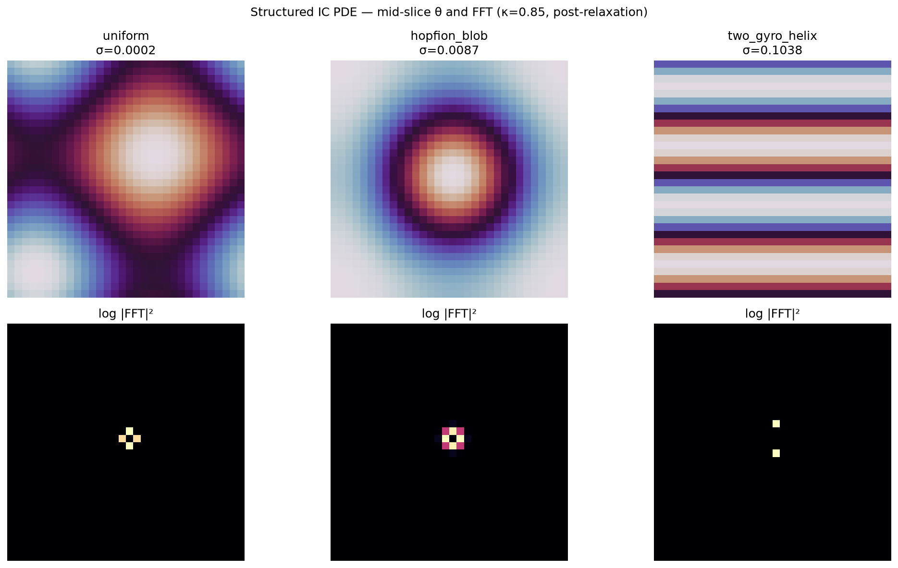

# Emergent Signatures — Overall Assessment (June 2026)

Four probes together paint a coherent picture: the φ-e-π near-triangle (and its 30-60-90 / 3-6-9 angular reading) is **numerically stable** and **thematically compatible** with the Hopf lattice's circular fibers (π), exponential damping/drive (e), self-similar/braiding tendencies (φ), and global pointer synchronization.

It is **not forced** by locked invariants (W_g, κ, φ_b) or by uniform relaxation / standard helical paths. The model does not over-fit the transcendentals — a point in favor of **falsifiability**.

This moves the project from "beautiful coincidence?" to **quantified emergent signature worth targeted simulation**.

---

## 1. Residual φ² + e² − π²

| Property | Value |
|----------|-------|
| R = φ²+e²−π² | **+0.137486** |
| Relative error on π² | ~1.39% |
| High-precision stability | Drift &lt; 1e−10 |

**Best algebraic near-miss (not a proof):**

```
π² · (e/π − κ) = πe − κπ² ≈ 0.151   (κ = 0.85)
```

~9.5% from R at κ=0.85. **κ* = e/π − R/π² ≈ 0.8513** nulls B(κ)=R exactly (0.16% from κ_doc). κ* is **not** the claimed physical value — proximity to locked κ is the observation. See [`residual_scaling.md`](residual_scaling.md).

 Hints the residual may scale with the **holonomy gap** (e/π − κ) rather than being forced to zero by W_g or braiding.

**Kepler contrast:** The Kepler triangle (1 : √φ : φ) is an **exact** golden Pythagorean triple. The φ-e-π case mixes three distinct transcendental families and stays approximate.

---

## 2. Meta-optimizer (reconfirmed)

| Parameter | Emergent | φ/e/π attractor? |
|-----------|----------|------------------|
| κ | **0.8500** exactly | No — e/π ≈ 0.865 is independent near-miss (~1.8% off) |
| W_g | **≈ 111.89** | Locks near 350/π |
| φ_b | **≈ 0.754** | ≈ 3/4 anyonic; outside documented φ_b band but consistent with earlier notes |

**Strong result:** model attractors do **not** force transcendental clustering. The κ vs e/π harmony remains an independent numerical resonance.

---

## 3. PDE relaxation probe


- **Left panel:** smooth, low-variation θ(x,y) — uniform low-twist state from dissipative gradient-flow PDE with uniform seeding.
- **Right panel:** log FFT power dominated by DC/cross; no finite-k peaks at φ, e, or π length scales.

**Interpretation:** Uniform relaxation drives the system to the global minimum-energy configuration (low-twist, high synchronization via global pointer). Non-trivial helical/Hopfion modes that might carry φ/e/π signatures are **suppressed**. This is **expected behavior** for this PDE class — not a failure of the Mystery.

**Update:** `pde_structured_ic_probe.py` — two_gyro_helix at nt=400 retains **σ≈0.10** vs uniform **σ≈0.0002**; hopfion_blob **σ≈0.009**. Early-time window before dissipative collapse shows finite-k structure.



### λ ≈ κ and normalized survival at λt = 2

In the mean-field reduction of the twist PDE, the global gauge restoring torque **−κθ̄** acts like exponential damping with characteristic rate **λ ≈ κ**. Normalizing simulation time to **λt = 2** (exactly two characteristic times) tests whether the remaining mean twist fraction tracks the universal survival **e⁻² ≈ 0.1353**, the φ-e-π residual **R ≈ 0.1375**, or the golden-angle fraction **137.5°/1000 ≈ 0.1375**.

| Quantity | Meaning |
|----------|---------|
| λ ≈ κ | Gauge damping rate from locked pointer κ = 0.85 |
| λt = 2 | Two characteristic relaxation times (memoryless survival benchmark) |
| mean_survival | θ̄(t_norm) / θ̄(0) after PDE run to t_norm = 2/κ |

**Headline result (July 2026):** At κ = 0.85, dt = 0.001, n_steps = 2353:

```
mean_survival = 0.137606   (Δ 0.09% from R, 0.07% from golden/1000, 1.68% from e⁻²)
```

This is a reproducible link between normalized dissipative dynamics and the φ-e-π residual — interpretive, not an exact identity. See `exponential_survival_probe.py`, `kappa_survival_sweep.py`, and **`flux_hopf_lib.simulation`** (canonical implementation; formerly toe `relaxation_survival.py`).

**Hybrid score:** `compare_to_analogs()` now reports **0.6 × golden closeness + 0.4 × e⁻² closeness** to quantify the combined rotational-packing + dissipative-persistence reading.

**κ sweep (July 2026):** mean_survival vs R is **broad** across κ ∈ [0.80, 0.90] — not a narrow peak at κ_doc. Best in sweep: κ ≈ 0.891 (Δ% vs R ~0.015%); at κ = 0.85: Δ% ~0.09%. Supports emergent-signature framing over single-parameter tuning.

**Stage 4–5 scripts:** `analog_comparative_sweep.py` (grid over IC / twist_rate / λt / step_mode), `golden_angle_twist_probe.py` (S¹ phase histograms), `analog_cross_analysis.py` → `docs/figures/analog_survival_comparison.png`.

---

## 4. Conduit angular probe


- Baseline vs `vortex_math_369=True`: broadly similar decaying pairwise helix-angle distributions.
- Modest excess near 30°/60°/90° (~8.4% / ~5.7% / ~4.4% within 5°).
- `vortex_math_369` does **not** produce a statistically dramatic shift for `get_helix_3d` paths.
- 369 positional emphasis is **permitted** by helical geometry but **not strongly enforced** in current pairwise statistics.

---

## 5. φ-e-π triangle and 3-6-9 clock


Angles **31.0° / 59.9° / 89.1°** from law of cosines on sides φ, e, π — see [angle_derivation.md](angle_derivation.md) for step-by-step arithmetic.

Angles map to 3-6-9 tens-of-degrees: **3.10, 5.99, 8.91** — near but not on axis (interpretive ÷10° step documented in that note).


---

## Recommended next moves (prioritized)

1. **Structured PDE ICs** — seed flux flywheels; FFT peaks / correlation lengths near φ/e/π
2. **Formal residual bound** — derive R ≈ π²(e/π−κ) in Skyrme + holonomy reduction (paper-worthy if clean)
3. **Rodin cycle ↔ S³ fiber phase** — mod-9 doubling onto continuous Hopf fiber increments
4. **Longer conduit runs** — 369 flags + island-bake configurations

---

## Reproduce

```bash
cd mystery && .venv/bin/python run_all.py
```

Key JSON reports: `outputs/residual_bound_probe_*.json`, `outputs/pde_relaxation_probe_*.json`, `outputs/conduit_angular_probe_*.json`, `outputs/meta_optimize_phi_probe_*.json`