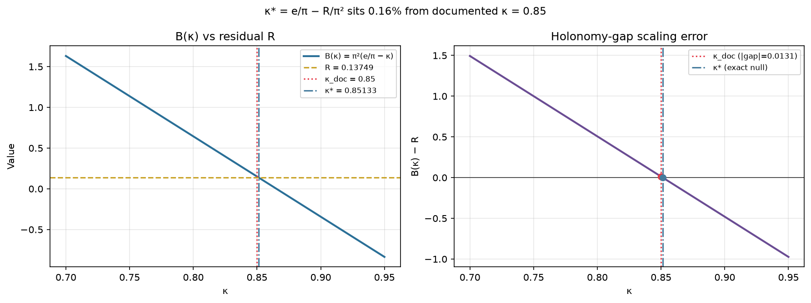

# Residual Scaling — π²(e/π − κ) and κ*

## Definitions

```
R  = φ² + e² − π² ≈ +0.137486
B(κ) = π²(e/π − κ) = πe − κπ²
```

## Exact null

Setting B(κ*) = R:

```
e/π − κ* = R/π²   ⟹   κ* = e/π − R/π² ≈ 0.8513
```

| κ | B(κ) | B(κ) − R | Relative gap |
|---|------|----------|--------------|
| 0.8500 (documented) | 0.15057 | +0.01308 | 9.5% of R |
| 0.8513 (κ*) | 0.13749 | ≈ 0 | ~0% |

κ* is **0.16%** from documented κ = 0.85.



---

## Interpretation

**κ* is not claimed to be the physical value.** It is the value of κ that would make the simple one-parameter scaling B(κ) = π²(e/π − κ) exactly equal to the Pythagorean residual R.

The noteworthy observation is that this exact-null κ* sits only **0.16%** from the model's locked invariant κ = 0.85 — while at κ_doc itself, B(κ) remains **~9.5%** above R. So:

- The scaling thread is **strengthened** (the holonomy gap e/π − κ appears to govern the residual scale).
- An **identity is not claimed** (documented κ does not null R; meta-optimizer does not pull toward e/π).
- The proximity of κ* to κ_doc suggests the TOE's choice of global pointer damping may sit near the value that would make the effective low-energy mismatch vanish — a **compatible emergent signature**, not a derived theorem.

In the Skyrme + global holonomy picture (formal derivation in [`skyrme_holonomy_derivation.md`](skyrme_holonomy_derivation.md)):

- **π²** = fiber saturation scale π × quadratic gauge energy \(\frac{\kappa}{2}\bar\theta^2\) at \(\bar\theta \sim \pi\).
- **(e/π − κ)** = holonomy gap between exponential drive capacity \(e\) and damping capacity \(\kappa\pi^2\).
- **κ\*** nulls \(B(\kappa)=R\) at first order; κ_sim ≈ 0.89 is the dynamic overshoot (see [`kappa_sim_interpretation.md`](kappa_sim_interpretation.md)).

---

## Verification

```bash
python scripts/skyrme_bound_derivation.py   # identity + κ* null checks
python scripts/residual_kappa_sweep.py      # sweep plot
```

---

## What remains open

1. Nonlinear cot(θ/2) and full \(F_{\mu\nu}\) corrections to \(B(\kappa)\).
2. PDE eigenstructure proof for survival minimum at κ ≈ 0.891 (separate from \(B(\kappa)\)).

## Reproduce

```bash
python scripts/residual_kappa_sweep.py
```

Output: `outputs/residual_kappa_sweep.png` (copied to `docs/figures/` for the repo).